<div align="center">
  
</div>

<h1 align="center">KING-OF-ECO</h1>
<p align="center"><strong>Economics / Data / AI / Policy Evaluation / Causal Inference</strong></p>

<p align="center">
  <a href="./README_EN.md"><strong>English Version</strong></a>
  &nbsp;|&nbsp;
  <a href="./README_ZH.md"><strong>中文版</strong></a>
</p>

<p align="center">
  
</p>

<p align="center">
  
  
  
  
</p>

<p align="center">
  <a href="mailto:13962101019@163.com">
    
  </a>
  
  
  
</p>

<p align="center">
  <em>Build the story. Stress the mechanism. Rule the noise.</em><br/>
  <em>构建问题，压测机制，统治噪音。</em>
</p>

<div align="center">
  
</div>

<div align="center">
  
</div>

## Bilingual Snapshot | 双语速览

<table>
  <tr>
    <td width="50%" valign="top">
      <strong>EN</strong><br/><br/>
      I study at the School of Economics, NJUPT. My profile sits at the intersection of economics, empirical design, policy evaluation, and the practical use of AI.<br/><br/>
      I care about questions that survive identification checks, code that survives reruns, and writing that survives reviewers.<br/><br/>
      This profile is designed as a research control panel rather than a decorative README.
    </td>
    <td width="50%" valign="top">
      <strong>中文</strong><br/><br/>
      我就读于南京邮电大学经济学院，关注经济学、实证识别、政策评估，以及 AI 在经济研究中的实际应用。<br/><br/>
      我更在意能扛住识别检验的问题、能扛住重复运行的代码、以及能扛住审稿意见的表达。<br/><br/>
      这个主页不是装饰型 README，而是一块研究控制台。
    </td>
  </tr>
</table>

## Profile Architecture | 页面结构

<table>
  <tr>
    <td width="33%" valign="top">
      <strong>Academic Identity | 学术定位</strong><br/><br/>
      Economics student at NJUPT, building around applied empirical research, policy evaluation, and economics x AI.
    </td>
    <td width="33%" valign="top">
      <strong>Research Temperament | 研究气质</strong><br/><br/>
      Identification first, mechanism aware, low-noise workflow, publication-ready communication.
    </td>
    <td width="33%" valign="top">
      <strong>Frontier Tracks | 前沿兴趣</strong><br/><br/>
      Text as data, computational social science, reproducible evidence systems, and intelligent tools for economics.
    </td>
  </tr>
</table>

## Research Narrative | 研究叙事

```text
QUESTION -> DESIGN -> IDENTIFICATION -> ROBUSTNESS -> MECHANISM -> COMMUNICATION
```

<table>
  <tr>
    <td width="50%" valign="top">
      <strong>What I optimize for</strong><br/><br/>
      - Clear causal questions<br/>
      - Defensible empirical strategy<br/>
      - Clean and repeatable workflows<br/>
      - Outputs that communicate before they overwhelm
    </td>
    <td width="50%" valign="top">
      <strong>我真正优化的东西</strong><br/><br/>
      - 清晰的因果问题<br/>
      - 能自圆其说的识别设计<br/>
      - 可复现、可迭代的数据流程<br/>
      - 先让读者看懂，再让读者深入的表达
    </td>
  </tr>
</table>

<div align="center">
  
</div>

## Signal Grid | 方法与工具

<p align="center">
  
  
  
  
  
  
  
  
  
  
</p>

## Metric Grid | 动态指标

<p align="center">
  
  
</p>

<p align="center">
  
</p>

## Contribution Snake

<p align="center">
  <picture>
    <source media="(prefers-color-scheme: dark)" srcset="https://raw.githubusercontent.com/KING-OF-ECO/KING-OF-ECO/output/github-snake-dark.svg" />
    <source media="(prefers-color-scheme: light)" srcset="https://raw.githubusercontent.com/KING-OF-ECO/KING-OF-ECO/output/github-snake.svg" />
    
  </picture>
</p>

## Deep Dive | 深入阅读

<table>
  <tr>
    <td width="50%" valign="top">
      <strong>English</strong><br/><br/>
      For a full English version of this profile, go to <a href="./README_EN.md">README_EN.md</a>.
    </td>
    <td width="50%" valign="top">
      <strong>中文</strong><br/><br/>
      如果你想看完整中文版，请打开 <a href="./README_ZH.md">README_ZH.md</a>。
    </td>
  </tr>
</table>

## Open Channel | 联系方式

If you are building something sharp at the intersection of economics, policy, data, and intelligent systems, reach me at <a href="mailto:13962101019@163.com">13962101019@163.com</a>.<br/>
如果你也在做经济学、政策评估、数据方法或智能系统相关的工作，欢迎通过 <a href="mailto:13962101019@163.com">13962101019@163.com</a> 联系我。
