<div align="center">
  
</div>

# KING-OF-ECO | English Version

[Back to Main README](./README.md) | [中文版](./README_ZH.md)

## About Me | "The Identification-First Builder"

I study at the School of Economics, Nanjing University of Posts and Telecommunications (NJUPT). My work sits at the intersection of economics, empirical design, policy evaluation, and the practical use of AI in research workflows.

I am especially interested in building research that is not only technically correct, but also structurally persuasive: a clean question, a credible design, a clear mechanism, and communication that survives scrutiny.

## Academic Identity

- School of Economics, NJUPT
- Focused on economics, policy evaluation, and causal inference
- Interested in economics x AI, text as data, and computational social science
- Working toward research outputs that are reproducible, readable, and reviewer-ready

## Research Philosophy

I do not treat data cleaning, modeling, tables, figures, and writing as separate chores. They are one integrated research system.

What matters to me most:

- Start from a question that is worth identifying
- Prefer designs that can defend themselves under pressure
- Use robustness checks to clarify, not to decorate
- Make outputs legible enough that readers understand the logic before the appendix

## Research Focus

### 1. Policy Evaluation

- Applied empirical research on policy effects
- Identification-centered design
- Mechanism-aware interpretation

### 2. Causal Inference

- Difference-in-differences and related designs
- Instrumental variables and empirical credibility
- Robustness, heterogeneity, and mechanism testing

### 3. Economics x AI

- Text as data for economics
- Intelligent tools for research workflows
- Computational methods that improve measurement and evidence production

## Frontier Interests

I am actively interested in expanding toward:

- Computational social science
- AI-assisted empirical workflows
- Unstructured data for economic measurement
- Reproducible research systems
- High-quality visual communication for technical work

## Toolchain

<p>
  
  
  
  
  
  
</p>

## Working Style

```text
QUESTION -> DESIGN -> IDENTIFICATION -> ROBUSTNESS -> MECHANISM -> COMMUNICATION
```

This is the order I trust. It keeps the work honest.

## Operating Motto

> Good research is not a pile of regressions. It is a clean question, a credible design, and a result that still stands after the hard questions arrive.

## Contact

- Email: [13962101019@163.com](mailto:13962101019@163.com)
- Main profile: [README.md](./README.md)
